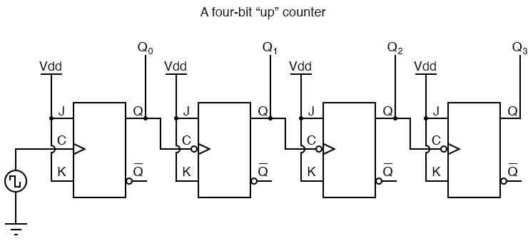
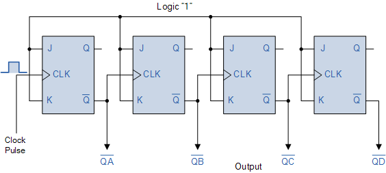
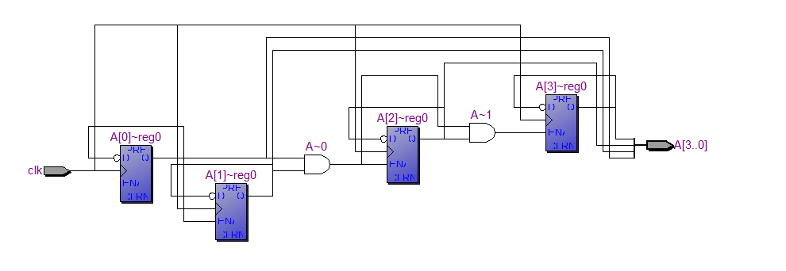
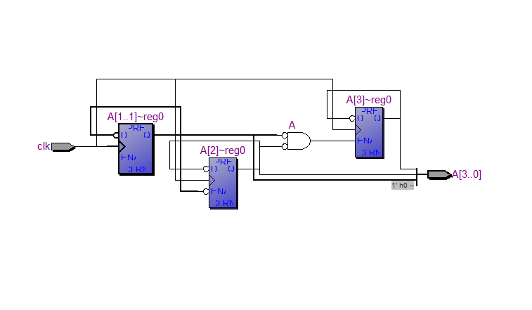
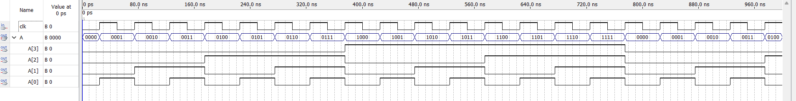
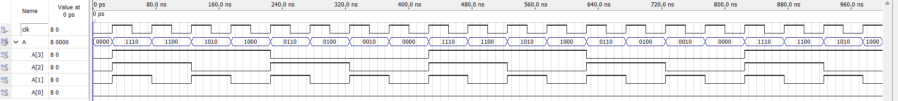

## TITTLE
Design and simulate 4 bit synchronous counter using verilog
## THEORY
### UP COUNTER
The counter is a digital sequential circuit and here it is a 4 bit counter, which simply means it can count from 0 to 15 and vice versa based upon the direction of counting (up/down).

The counter (“count“) value will be evaluated at every positive (rising) edge of the clock (“clk“) cycle. The Counter will be set to Zero when “reset” input is at logic high. The counter will be loaded with “data” input when the “load” signal is at logic high. Otherwise, it will count up or down. The counter will count up when the “up_down” signal is logic high, otherwise count down

Since we know that binary count sequences follow a pattern of octave (factor of 2) frequency division, and that J-K flip-flop multivibrators set up for the “toggle” mode are capable of performing this type of frequency division, we can envision a circuit made up of several J-K flip-flops, cascaded to produce four bits of output. The main problem facing us is to determine how to connect these flip-flops together so that they toggle at the right times to produce the proper binary sequence. Examine the following binary count sequence, paying attention to patterns preceding the “toggling” of a bit between 0 and 1: Binary count sequence, paying attention to patterns preceding the “toggling” of a bit between 0 and 1.

Note that each bit in this four-bit sequence toggles when the bit before it (the bit having a lesser significance, or place-weight), toggles in a particular direction: from 1 to 0.

Starting with four J-K flip-flops connected in such a way to always be in the “toggle” mode, we need to determine how to connect the clock inputs in such a way so that each succeeding bit toggles when the bit before it transitions from 1 to 0.


### DOWN COUNTER
As well as counting “up” from zero and increasing or incrementing to some preset value, it is sometimes necessary to count “down” from a predetermined value to zero allowing us to produce an output that activates when the zero count or some other pre-set value is reached.

This type of counter is normally referred to as a Down Counter, (CTD). In a binary or BCD down counter, the count decreases by one for each external clock pulse from some preset value. Special dual purpose IC’s such as the TTL 74LS193 or CMOS CD4510 are 4-bit binary Up or Down counters which have an additional input pin to select either the up or down count mode.


## LOGIC DIAGRAM
### UP COUNTER

### DOWN COUNTER


## PROGRAM
```verilog
UP COUNTERS CODE:
module upcounters(clk,A);
input clk;
output reg [3:0]A;
always @(posedge clk)
begin
	A[3]=(((A[0])&(A[1])&(A[2]))^A[3]);
	A[2]=(((A[0])&(A[1]))^A[2]);
	A[1]=(A[0])^A[1];
	A[0]=A[0]^1;
end
endmodule


DOWN COUNTERS CODE:
module downcounters(clk,A);
input clk;
output reg [3:0]A;
always@(posedge clk)
begin
	A[3]=(((~A[0])&(~A[1])&(~A[2]))^A[3]);
	A[2]=(((~A[0])&(~A[1]))^A[2]);
	A[1]=(~A[0])^A[1];
	A[0]=(~A[0])^1;
end
endmodule

```
## NETLIST DIAGRAM
### UP COUNTER

### DOWN COUNTER

## TIMING DIAGRAM
### UP COUNTER

### DOWN COUNTER

